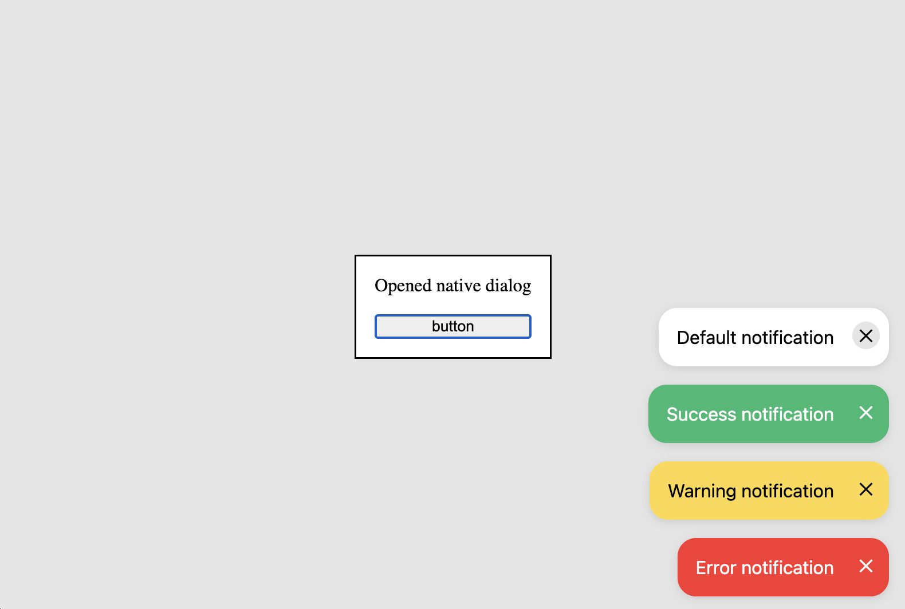

## Notifier

A modern alternative to Notistack (or similar).
- Framework-agnostic
- Zero dependencies
- Extra-small size
- Customizable




### Usage
```js
// Import in your index.js/ts
import { Notifier } from 'light-notifier'
new Notifier()

// Somewhere in your code
import { UiNotification } from 'light-notifier'
const notification = new UiNotification()
        .setMessage('Default notification')

notification.show()
notification.hide()
// That's all 😎
```

### Configuration
```js
// The notifier itself
import { Notifier } from 'light-notifier'

// Default alignment: vertical = bottom, horizontal = right

// top-left
new Notifier().alignToTop().alignToLeft()

// top-right
new Notifier().alignToTop()

// bottom-left
new Notifier().alignToLeft()

// top-left with auto-hide
new Notifier()
    .alignToTop()
    .alignToLeft()
    .setAutoHideDurationInMs(3000)


// The Notification
import { UiNotification } from 'light-notifier'
new UiNotification() 
  .canvas() // Canvas color
  .success() // Success color
  .warning() // Warning color
  .error() // Error color
  .setMessage('Notification text')
  .setAutoHideDurationInMs(3000) // takes precedence over Notifier.setAutoHideDurationInMs
  .show() 
  .hide()
```

### Customization
```css
/* Somewhere in your css */
.ui-notification {
    /*  Customize me  */
    &.warning {  }
    &.error {  }
    &.success { }
    &.closable { 
        /*  Has an pseudo close button  */
        &:after {
         /* Apply icon styles here */
        }
    }
}
```

#### Tricks
It's a bad practice, but anyway
```typescript
// Somewhere in your d.ts
declare global {
  interface Window {
    UiNotification: UiNotification
  }
}

// In your index.js
Reflect.set(window, 'UiNotification', UiNotification)

// Anywhere in your code
new UiNotification()
 .setMessage('I am available in global context')
```

### FAQ
- <b>Does it work on {Some-browser-version}</b><br/>
  It works anywhere, where the hidePopover is supported. See the [Caniuse](https://caniuse.com/mdn-api_htmlelement_hidepopover).<br/>
  Chromium > 114; Safari > 17; Opera > 100; Firefox > 125 e.t.c
- <b>Can I add some html to notification?</b> <br />
  Not in this library. The notification should be simple.
  If you need something more complicated, use dialog instead.<br/>

You can open an issue,
or vote for an existing one about adding an icon and a title for notification,
similar to [Notification](https://developer.mozilla.org/en-US/docs/Web/API/Notification)